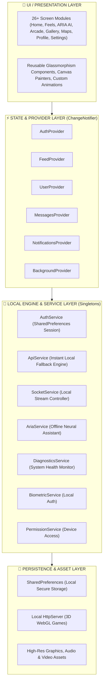
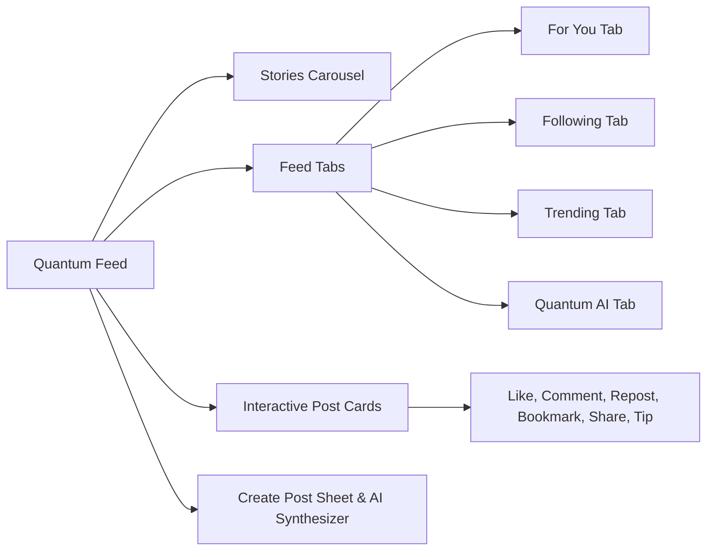
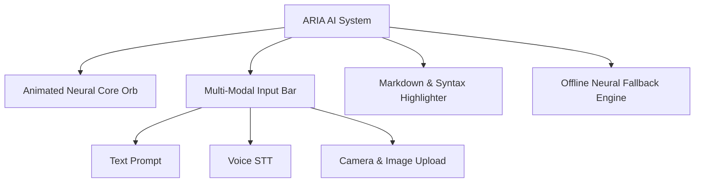
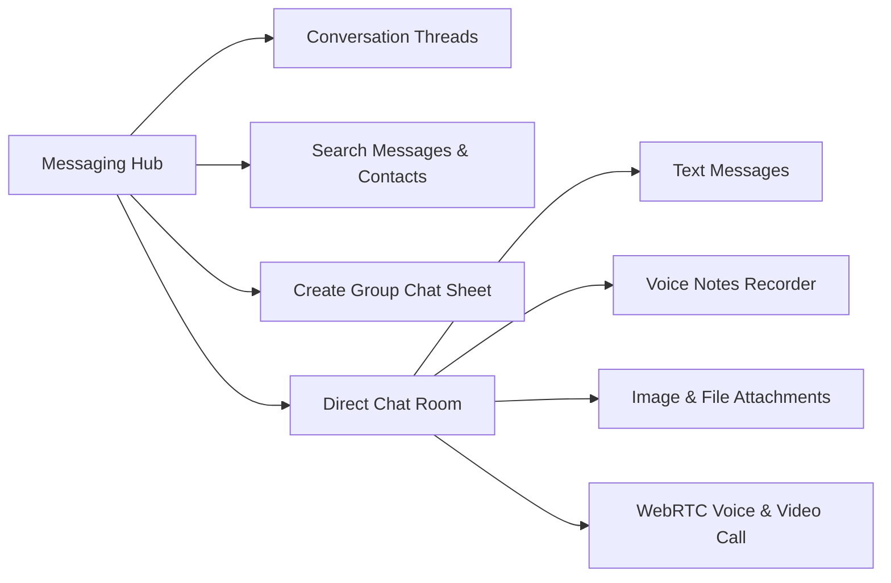
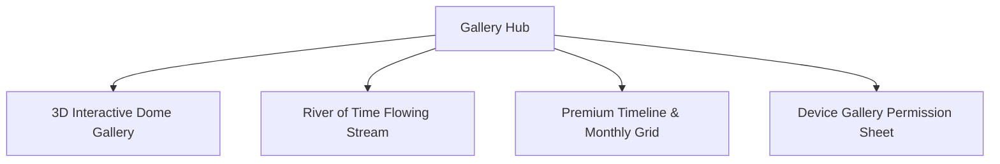
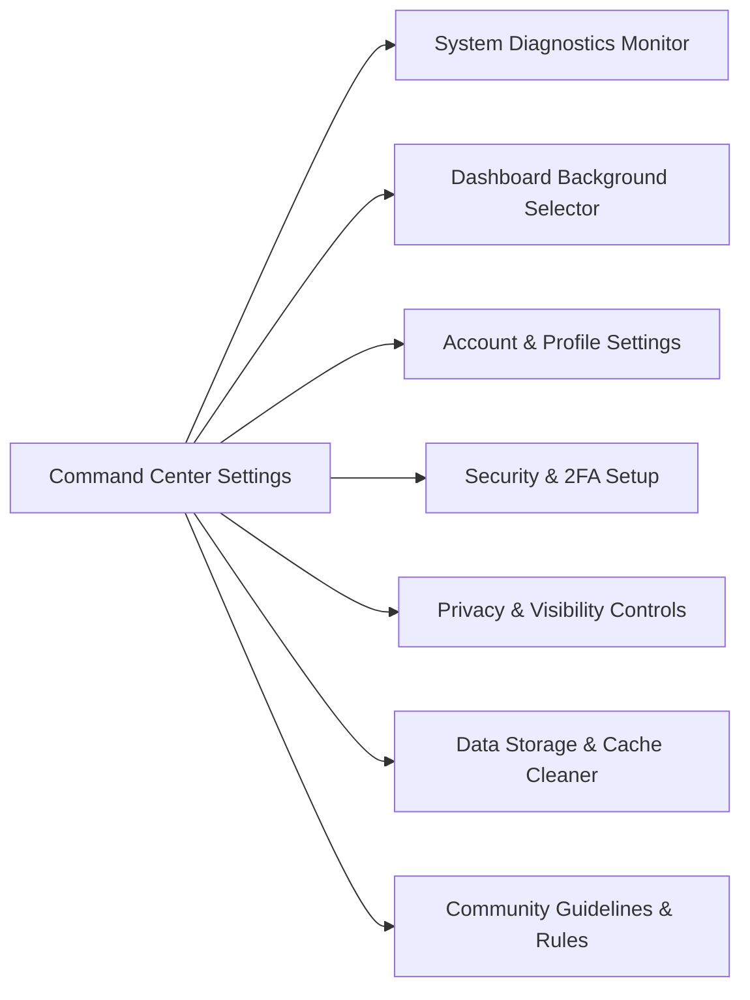

# 🌌 NEXAL APP - SYSTEM ARCHITECTURE & FEATURE BLUEPRINT

## 📌 EXECUTIVE ARCHITECTURAL OVERVIEW

**Nexal** is an ultra-luxurious, futuristic decentralized social ecosystem, multi-modal AI platform, and 3D WebGL gaming realm. The application is architected following **Clean Layered Architecture** principles in Flutter, combined with a **100% Standalone Offline Engine** pattern to guarantee zero external downtime, instant local state persistence, and ultra-high frame-rate UI rendering.

---

## 🏛️ LAYERED ARCHITECTURE SPECIFICATION

### 1. Presentation Layer (`lib/screens/`, `lib/widgets/`)
- **Design Aesthetic**: Ultra-luxurious Cybernetic Glassmorphism with dynamic neon accents (`#A855F7` Purple, `#06B6D4` Cyan, `#EC4899` Pink), custom backdrop blur filters (`ImageFiltered`/`BackdropFilter`), and fluid micro-animations.
- **Error Boundaries**: Every image widget utilizes `errorBuilder` fallback mechanics, preventing red error screens across online and offline states.

### 2. State Management Layer (`lib/providers/`)
- **Reactive Architecture**: Built using Flutter `Provider` (`ChangeNotifier`) and `ChangeNotifierProxyProvider` for seamless data binding between authentication changes, messaging streams, and live UI feeds.

### 3. Local Engine Service Layer (`lib/services/`)
- **Standalone Offline Engine**: Operates independently of remote server availability. Network requests are handled by local state engines with fallback generators.

### 4. Data & Local Infrastructure (`lib/config/`, `assets/`)
- **Embedded WebGL Server**: Runs a lightweight local `HttpServer.bind(InternetAddress.anyIPv4, 0)` serving local WebGL 3D games (Three.js engines) directly into Flutter `WebViewWidget`.

---

## 📱 FEATURE-WISE & OPTION-WISE MODULE BREAKDOWN

---

### MODULE 1: AUTHENTICATION & SECURITY ENGINE

#### 1. Splash & Auth Router (`splash_router.dart`)
* **Features**:
  * Automatic active session checking upon launch.
  * Deep link payload handling (custom URI schemes).
* **Options**:
  * Auto-redirect to `HomeScreen` if local session exists.
  * Auto-redirect to `LoginScreen` if no session is stored.

#### 2. Liquid Glass Login Screen (`login_screen.dart`)
* **Features**:
  * Cyberpunk glass container with animated gradient background (`login BG.png`).
  * Email & Password validation.
  * Instant Guest Mode access.
* **Options**:
  * **Email Input Field**: Real-time validation, clear text action.
  * **Password Input Field**: Secure password masking toggle (eye icon).
  * **Sign In Button**: Triggers `AuthService.login()`.
  * **Quick Guest Login Button**: Enters instant debug guest mode (`loginAsGuest()`).
  * **Create Account Link**: Opens 6-Digit Email OTP Signup modal.

#### 3. Signup & 6-Digit Email OTP Engine (`signup_screen.dart`)
* **Features**:
  * Step 1: User details input (Full Name, Email, Password).
  * Step 2: 6-Digit OTP verification sheet.
* **Options**:
  * **Full Name & Email Inputs**: Text validation.
  * **Password Strength Meter**: Real-time strength indicator.
  * **OTP Input Cells**: 6 individual auto-focusing numeric cells.
  * **Resend Code Button**: Triggers local OTP regeneration countdown.

#### 4. Biometric Lock & Security Screen (`biometric_lock_screen.dart`)
* **Features**:
  * Fingerprint & FaceID device authentication via `BiometricService`.
* **Options**:
  * **Authenticate Button**: Triggers OS local auth prompt.
  * **Fallback PIN Button**: Manual PIN entry dialog.

---

### MODULE 2: QUANTUM FEED & SOCIAL HUB (`home_view.dart`, `home_screen.dart`)

#### 1. Glass Header & Navigation Bar
* **Options**:
  * **App Brand Logo**: Tap to scroll feed to top.
  * **Search Quick Action**: Navigates to `SearchView`.
  * **Notifications Bell**: Badged icon, opens Notifications Drawer.
  * **Messages Direct Icon**: Unread badge count, navigates to `MessagesView`.

#### 2. Stories Carousel
* **Features**:
  * Horizontal scrolling avatar list with gradient live ring indicators.
* **Options**:
  * **Add Story Button (+)**: Opens Camera Studio to capture story.
  * **User Story Item**: Tap to launch full-screen `StoryViewerScreen`.

#### 3. Quantum Feed Switcher Tabs
* **Options**:
  * **For You**: Algorithmic recommendation feed.
  * **Following**: Chronological feed from followed creators.
  * **Trending**: High-engagement viral posts.
  * **Quantum AI**: AI-generated posts and neural insights.

#### 4. Interactive Post Cards
* **Options**:
  * **User Avatar & Username**: Tap to open creator's `ProfileView`.
  * **Verification Badge**: Indicates verified status.
  * **Follow/Unfollow Toggle**: Quick inline follow button.
  * **Post Content Text**: Clickable hashtags and `@mentions`.
  * **Media Attachments**: Support for high-res images, carousel slides, and inline video previews with fullscreen tap handler.
  * **Like Heart Button**: Haptic feedback, animated particle count increment.
  * **Comment Drawer Trigger**: Opens bottom sheet with real-time comment thread.
  * **Repost / Quote Post Button**: Shares post to user's profile.
  * **Bookmark Button**: Saves post to local saved collection.
  * **Share Sheet**: Native OS share trigger (`share_plus`).
  * **Quantum Tip (Crypto/Coins)**: Sends tip to content creator.

#### 5. Create Post Sheet & Neural Art Synthesizer
* **Options**:
  * **Text Input Area**: Multiline rich text input.
  * **Attach Photo / Gallery**: Launches native image selector.
  * **Neural Art Generator Button**: Opens AI prompt bar to synthesize custom AI images inline.
  * **Privacy Selector**: Options for Public, Followers Only, or Private.
  * **Publish Post Button**: Pushes post to local feed store.

---

### MODULE 3: ARIA MULTI-MODAL AI ASSISTANT (`ai_assist_view.dart`)

#### 1. Animated Neural Core Orb
* **Features**:
  * Custom canvas painter rendering glowing neon purple-cyan wave pulses.
  * State indicators: Idle, Listening, Processing, Speaking.

#### 2. Multi-Modal Input Controls
* **Options**:
  * **Text Prompt Input Bar**: Auto-expanding input field with clear action.
  * **Voice Input Button (Microphone)**: Real-time Speech-to-Text (`speech_to_text`).
  * **Camera & Image Attachment Button**: Attaches photos for visual analysis.
  * **Send Action Button**: Triggers ARIA inference.

#### 3. Rich Conversation & Response Canvas
* **Options**:
  * **Markdown Code Blocks**: Full syntax highlighting for Dart, Python, JS, HTML, C++.
  * **Copy Code Action**: One-tap copy to clipboard.
  * **Text-to-Speech (TTS) Speaker Icon**: Reads AI response aloud via local TTS engine.
  * **Regenerate Response Action**: Re-runs query.
  * **Clear Conversation Action**: Resets chat memory.

---

### MODULE 4: FEELS REELS & VERTICAL VIDEO ENGINE (`feels_view.dart`, `video_view.dart`)

#### 1. Full-Bleed Vertical PageView
* **Features**:
  * Smooth vertical snapping PageView (`preload_page_view`).
  * Automatic video playback management (plays active reel, pauses off-screen reels).

#### 2. Gesture Interactions & Overlays
* **Options**:
  * **Single Tap**: Pause / Play video.
  * **Double Tap**: Spawns floating heart particle explosion at tap coordinates and likes video.
  * **Creator Profile Avatar**: Tap to view creator profile.
  * **Like Heart Button**: Toggles like with count animation.
  * **Comment Drawer Button**: Opens real-time comment thread.
  * **Share Reel Button**: Shares video link or downloads video.
  * **Spinning Audio Disk**: Shows track name, tap to open audio page.

---

### MODULE 5: CHAT & REAL-TIME MESSAGING HUB (`messages_view.dart`, `chat_screen.dart`, `call_screen.dart`)

#### 1. Conversation List Screen
* **Options**:
  * **Online Contacts Ribbon**: Horizontal avatar list of active online friends.
  * **Search Bar**: Filters conversations by username or message content.
  * **Chat Thread Item**: Shows avatar, display name, last message, timestamp, unread badge.
  * **Create Group Chat Button (+)**: Opens group setup sheet.

#### 2. Direct Chat Room Screen
* **Options**:
  * **Header**: User status (Online/Offline), Voice Call Button, Video Call Button.
  * **Message Bubble Thread**: Distinct user/partner glass bubbles with timestamp and read receipts.
  * **Voice Note Recording Button**: Hold to record audio message (`record`), release to send.
  * **Image & Media Picker**: Attach photos or gallery images.
  * **Emoji Picker Drawer**: Integrated `emoji_picker_flutter` keyboard.
  * **Send Button**: Emits message via local `SocketService`.

#### 3. WebRTC Voice & Video Call Screen
* **Options**:
  * **Call Controls**: Mute Microphone, Toggle Camera, Switch Camera, End Call Red Button.

---

### MODULE 6: ARCADE & 3D WEBGL GAMING REALM (`open_world_games_view.dart`, `game_webview_screen.dart`)

#### 1. Cloud Arcade Game Catalog
* **Featured Games**:
  * **VOXEL REALM 3D**: Open-world 3D voxel sandbox game engine (procedural terrain, block placing/breaking, first-person controls).
  * **WORDL 3D**: 3D spatial word puzzle game.
  * **Cyber Runner**: Futuristic 3D endless runner.
  * **Space Assault**: 3D galaxy space shooter.
* **Options**:
  * **Game Card Gesture Detector**: Tap to launch webview server.
  * **Category Filter Chips**: 3D Open World, Puzzle, Action, Arcade.

#### 2. Embedded WebGL Local Game Server
* **Features**:
  * Runs local `HttpServer` bound to `InternetAddress.anyIPv4` serving HTML5/Three.js assets.
  * Cleartext HTTP traffic enabled (`android:usesCleartextTraffic="true"`).
* **Options**:
  * **Full-Screen WebView**: Fullscreen WebGL rendering with touch joystick controls.
  * **Back / Exit Game Floating Action**: Cleanly terminates local server and returns to Arcade.

---

### MODULE 7: MULTI-DIMENSIONAL GALLERY (`gallery_view.dart`, `immersive_dome_gallery_view.dart`, `monthly_timeline_view.dart`)

#### 1. 3D Interactive Dome Gallery (`dome_gallery.dart`)
* **Features**:
  * Spherical 3D photo mesh layout with drag/rotate gestures.
* **Options**:
  * **Photo Node Tap**: Focuses photo in center view.
  * **Mode Toggle**: Switch between Dome mode and Grid mode.

#### 2. River of Time Gallery (`river_of_time_gallery.dart`)
* **Features**:
  * Continuous horizontal flowing memory stream with glowing cyan highlights.

#### 3. Premium Timeline Gallery (`premium_timeline_gallery.dart`)
* **Features**:
  * Chronological photo organization grouped by year, month, and memory album.
* **Options**:
  * **Permission Sheet (`permission_bottom_sheet.dart`)**: Requests storage permissions to index device photos (`photo_manager`).

---

### MODULE 8: CYBERNETIC MAPS & RADAR NAVIGATOR (`map_view.dart`)

#### 1. Holographic Radar Map Canvas
* **Features**:
  * Dark custom map styling with interactive user radar pulsing rings.
* **Options**:
  * **User Marker Pin**: Displays current GPS coordinates (`geolocator`).
  * **Nearby Contacts Pins**: Displays distance in meters and avatar.
  * **Center My Location Button**: Smoothly animates map camera to user position.
  * **Share My Live Location Button**: Sends location link in chat.

---

### MODULE 9: UNIVERSAL SEARCH & DISCOVERY PORTAL (`search_view.dart`)

#### 1. Multi-Category Search Engine
* **Options**:
  * **Search Input Bar**: Real-time query matching with clear action.
  * **Category Tabs**:
    * **Top**: Aggregated best results.
    * **Users**: Filter by user profile accounts.
    * **Posts**: Search post texts and hashtags.
    * **Reels**: Search vertical video reels.
    * **News**: Live global tech & social updates.
    * **Games**: Search Arcade titles.
  * **Trending Hashtags Carousel**: Tap hashtag to auto-fill search bar.

---

### MODULE 10: CYBER PROFILE & ANALYTICS (`profile_view.dart`, `profile_analytics_screen.dart`, `followers_list_screen.dart`)

#### 1. Profile Header & Customization
* **Options**:
  * **Banner & Avatar Images**: Tap to view or edit profile avatar.
  * **Display Name & Username**: Display handle and verification status.
  * **Bio & Web Link**: Clickable URL link (`url_launcher`).
  * **Edit Profile Button**: Opens edit profile modal.
  * **Share Profile QR Code**: Displays custom QR code (`qr_flutter`).

#### 2. Stats & Tabbed Media Grid
* **Options**:
  * **Stats Row**: Counters for Posts, Followers, Following, Reputation Points.
  * **Followers / Following Button**: Opens `FollowersListScreen`.
  * **Analytics Dashboard Button**: Opens `ProfileAnalyticsScreen` (views, reach, growth charts).
  * **Grid Tabs**: Posts, Feels Reels, Saved Bookmarks, Liked Content.

---

### MODULE 11: CAMERA & SNAPSHOT STUDIO (`camera_view.dart`, `camera_preview_screen.dart`)

#### 1. Camera Viewfinder & Mode Selector
* **Options**:
  * **Flash Toggle**: Off, Auto, On, Torch.
  * **Camera Switcher**: Flip between Front & Back camera.
  * **AR Filters Carousel**: Real-time facial filters and color presets.
  * **Capture Button**: Tap for Photo, Hold for Video Recording.
  * **Gallery Thumbnail**: Quick access to recent photos.

---

### MODULE 12: COMMAND CENTER & SYSTEM SETTINGS (`lib/screens/settings/`)

#### 1. System Diagnostics Monitor (`diagnostics_service.dart`)
* **Options**:
  * **Run Full Audit Button**: Pings all local engine components (Gateway, ARIA AI, Feed, Maps, Arcade, Supabase DB).
  * **Live Status Gauge**: Displays latency (`12ms`) and green online indicator.

#### 2. Dashboard Background Selector (`dashboard_background_screen.dart`)
* **Options**:
  * **Preset Wallpapers**: Cyber Neon, Quantum Core, Deep Cosmos, Obsidian Dark.
  * **Custom Image Picker**: Upload custom wallpaper from device storage.
  * **Blur & Opacity Sliders**: Live preview adjustment.

#### 3. Account Settings (`account_settings_screen.dart`)
* **Options**:
  * **Edit Email & Username**: Input field updates.
  * **Change Password**: Secure password update form.
  * **Logout Button**: Clears local session in `SharedPreferences`.

#### 4. Security & 2FA (`two_factor_screen.dart`)
* **Options**:
  * **Biometric Lock Toggle**: Enables Fingerprint / FaceID lock on app start.
  * **Two-Factor Authentication (2FA) Toggle**: Generates TOTP secret code & QR code (`otp`).

#### 5. Privacy Settings (`privacy_settings_screen.dart`)
* **Options**:
  * **Private Account Switch**: Toggles account privacy.
  * **Read Receipts Switch**: Toggles message read receipts.
  * **Blocked Users List**: Manages blocked user accounts.

#### 6. Data Storage & Cache (`data_storage_screen.dart`)
* **Options**:
  * **Clear Cache Button**: Clears image memory cache (`200MB`).
  * **Data Saver Switch**: Reduces image download resolutions.

#### 7. Community Guidelines & Rules (`community_guidelines_screen.dart`)
* **Options**:
  * Interactive view of platform rules, 4-strike policy, permitted conduct, and feature options guide.

---

## 🛠️ TECHNICAL SPECIFICATIONS SUMMARY

| Architectural Attribute | Implementation Specification |
| :--- | :--- |
| **Framework & SDK** | Flutter 3.x / Dart 3.x |
| **UI Paradigm** | Custom Cybernetic Glassmorphism & Material Design 3 |
| **State Management** | Provider (`ChangeNotifier`, `ChangeNotifierProxyProvider`) |
| **Local Persistence** | `SharedPreferences`, `FlutterSecureStorage` |
| **Offline Backend Engine** | `AuthService`, `ApiService`, `SocketService`, `AriaService` |
| **3D Graphics Engine** | WebGL / Three.js served via local `HttpServer` into `WebViewWidget` |
| **Media Player** | Custom Video Player (`video_player`) & Custom Audio Player (`audioplayers`) |
| **Device Hardware Access** | `camera`, `geolocator`, `speech_to_text`, `record`, `local_auth`, `photo_manager` |
