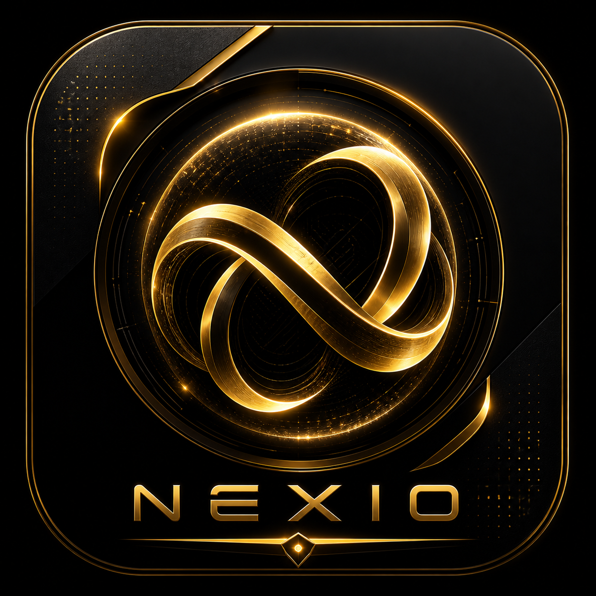

<p align="center">
  
</p>

<h1 align="center">NEXAL</h1>
<p align="center"><em>A futuristic social media experience — built with Flutter</em></p>

<p align="center">
  
  
  
  
</p>

---

## ✦ What is Nexal?

Nexal is a premium, space-themed social media app with a deep-space dark UI, glassmorphism effects, micro-animations, and gyroscope-driven parallax. It demonstrates what a production-quality Flutter UI can look like when every pixel is intentional.

> **Note:** This is a UI-focused project. All data is mocked — no backend required to run.

---

## 🎨 Design Language

| | |
|---|---|
| **Background** | Pure black `#000000` |
| **Primary** | Purple `#A855F7` → Pink `#EC4899` gradient |
| **Highlight** | Cyan `#06B6D4` |
| **Tertiary** | Blue `#3B82F6` |
| **Titles** | Google Fonts **Rye** |
| **Body** | Google Fonts **Outfit** |
| **Cards** | Glassmorphic — frosted blur, thin borders, translucent fills |
| **Animations** | `flutter_animate` for entrances + custom `AnimationController` for continuous glow/pulse effects |

---

## 🚀 Features

### Core Screens

| Screen | Highlights |
|---|---|
| **Galaxy Hub** | Orbital spring-physics navigation wheel, looping video background, gyro parallax |
| **Quantum Feed** | Social feed with AI-curated posts, trending topics, live status bar |
| **Feels (Reels)** | Vertical short-video feed, double-tap like, comments, share, bookmark |
| **Messages** | Primary/Requests tabs, swipe-to-dismiss, animated gradient header with gyro parallax |
| **Chat** | Send/receive bubbles, emoji picker, attachments, voice/video call UI, AI auto-reply |
| **Video Hub** | Continue watching (progress rings), trending rankings, bookmarks, cast button |
| **Camera** | Live preview, pinch-to-zoom, flash/timer/grid, 6 real-time color filters, 4 capture modes |
| **Explore** | Animated nebula background, trending rankings, masonry discovery grid, AI suggestions |
| **ARIA (AI)** | 7-layer animated neural orb, waveform visualizer, quick commands, chat with typing indicator |
| **Profile** | Editable fields, achievement badges, 4-tab content grid, privacy/notification settings |
| **Gallery** | Premium timeline layout, dome gallery, river-of-time viewer |

### Polish & Performance

- **CachedNetworkImage** across all screens for persistent image caching
- **Shimmer skeleton loaders** on feed and messages during data fetch
- **ListView.builder** for memory-efficient scrolling (no off-screen widget retention)
- **Staggered entrance animations** with 60ms delay per item
- **ZoomPageTransitionsBuilder** globally for premium screen transitions
- **Splash video** plays the branded cinematic on every launch

---

## 📁 Project Structure

```
lib/
├── main.dart
├── theme/
│   └── app_theme.dart              # Colors, gradients, ThemeData
├── utils/
│   └── filter_generator.dart       # Camera color filter presets
├── screens/
│   ├── splash_video_screen.dart    # Boot cinematic
│   ├── home_screen.dart            # Galaxy hub + orbital nav
│   ├── home_view.dart              # Social feed
│   ├── feels_view.dart             # Vertical reels
│   ├── messages_view.dart          # DM inbox
│   ├── chat_screen.dart            # Individual chat
│   ├── video_view.dart             # Streaming hub
│   ├── camera_view.dart            # Camera capture
│   ├── search_view.dart            # Explore / discover
│   ├── ai_assist_view.dart         # ARIA AI companion
│   ├── profile_view.dart           # User profile
│   ├── gallery_view.dart           # Photo gallery
│   └── ...                         # Preview, timeline, dome views
└── widgets/
    ├── background/                 # Video + particle backgrounds
    ├── common/                     # PostCard, GlassEmptyState
    ├── effects/                    # Gyro parallax wrapper
    ├── navigation/                 # Quantum arc menu
    ├── notifications/              # Notification sheet
    ├── settings/                   # Settings modal
    └── gallery/                    # Dome, timeline, river galleries
```

---

## ⚙️ Getting Started

### Prerequisites

- Flutter SDK `>=3.10.7`
- Android Studio / Xcode (for mobile)
- A physical device recommended (gyroscope + camera features)

### Run

```bash
git clone https://github.com/aaweshdas/The-New-Era-_-Nexal-APP-.git
cd The-New-Era-_-Nexal-APP-
flutter pub get
flutter run
```

---

## 📦 Dependencies

| Package | Purpose |
|---|---|
| `flutter_animate` | Declarative animations |
| `google_fonts` | Outfit, Rye typography |
| `lucide_icons` | Icon set |
| `glassmorphism_ui` | Frosted glass containers |
| `sensors_plus` | Gyroscope parallax |
| `cached_network_image` | Image caching & performance |
| `shimmer` | Skeleton loading states |
| `video_player` | Splash video & backgrounds |
| `camera` | Live camera capture |
| `permission_handler` | Runtime permissions |
| `image_picker` | Gallery selection |
| `provider` | State management |

---

## 🗒️ Notes

- All content is **mocked** — avatars from Unsplash, images from Picsum
- No authentication or backend — purely a UI/UX showcase
- Camera features are **real** — flash, zoom, timer, filters all functional
- The AI assistant (ARIA) returns context-aware keyword-matched responses, not LLM-powered
- Network images include error fallbacks for offline resilience

---

## 👤 Author

**Aawesh Das**  
[@aaweshdas](https://github.com/aaweshdas)

---

<p align="center">
  <sub>Built with ☕ and Flutter • 2026</sub>
</p>
